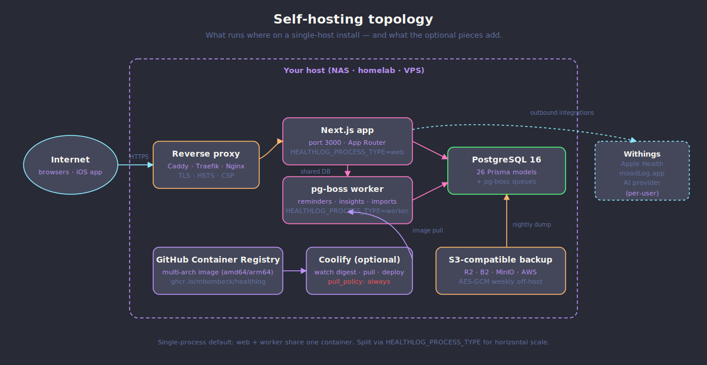

<p align="center">
  
</p>

<h1 align="center">HealthLog</h1>

<p align="center">
  <strong>Your health data belongs to you. Track it on your own terms.</strong>
</p>

<p align="center">
  <a href="LICENSE"></a>
  <a href="https://github.com/MBombeck/HealthLog/releases"></a>
  <a href="https://testflight.apple.com/join/bucuTBpa"></a>
  
  
  
  <a href="https://github.com/MBombeck/HealthLog/pkgs/container/healthlog"></a>
  <a href="https://buymeacoffee.com/mbombeck"></a>
</p>

<p align="center">
  Self-hosted health tracker. Weight, blood pressure, glucose, mood, medications.<br/>
  Withings, WHOOP, Google Health/Fitbit, and Apple Health sync, multi-provider AI insights you own, doctor-report PDF.
</p>

<p align="center">
  <a href="https://healthlog.dev">Website</a> &middot;
  <a href="https://demo.healthlog.dev">Live Demo</a> &middot;
  <a href="https://docs.healthlog.dev">Documentation</a> &middot;
  <a href="https://testflight.apple.com/join/bucuTBpa">iOS TestFlight</a>
</p>


---

## What it is

HealthLog is a self-hosted personal health tracker that runs from a single `docker compose up`. It covers the metrics most people actually log -- weight, blood pressure, pulse, body composition, blood glucose, sleep, mood, and medication compliance -- and brings them together in one dashboard with reference ranges from ESH 2023, ADA 2024, and NICE NG115. Withings, WHOOP, and Google Health/Fitbit devices sync automatically over OAuth2; an `export.zip` import folds your full Apple Health history into the same timeline; a native SwiftUI iOS client (public-beta via [TestFlight](https://testflight.apple.com/join/bucuTBpa)) streams HealthKit live; multi-provider AI insights (BYOK or local) explain what the numbers mean; a doctor-report PDF generates client-side. EN/DE end-to-end. AGPL-3.0.

> **Status**: active. New releases roughly weekly -- see [CHANGELOG](CHANGELOG.md). Current line: v1.12 — a Google Health/Fitbit connection for Fitbit and Pixel wearables (experimental, see [Integrations](#integrations)) and a rebuilt mood log (five-face capture, a structured tag catalog, and rated daily-life factors), on top of the v1.11 mood-relations and sleep-depth insights, a read-only FHIR R4 API with shareable clinician records, the v1.10 derived-metrics tier (fitness-age, vascular-age delta, HRV balance, sleep score, readiness and recovery scores, an early-strain flag), and the v1.7 health-record export (PDF + FHIR R4). The native iOS client is public-beta via [TestFlight](https://testflight.apple.com/join/bucuTBpa).

> **Heavily developed.** HealthLog ships multiple releases per week. Behaviour, API shapes, and database schema can change between minor versions; migrations are forward-only and not all are rehearsed against every legacy fixture. If you self-host, pin a tag, take a backup before every upgrade, and read the [CHANGELOG](CHANGELOG.md) before pulling `latest`. Issue reports and PRs welcome — this is the rough edge where the project gets sharper.

Built for people who want their health data on their own server -- whether that's a NAS, a homelab, or a small VPS -- and who don't want to hand it to a US cloud to read a 7-day weight trend. **Try the [live demo](https://demo.healthlog.dev)** to see what a working install looks like, or skip to [Quick Start](#quick-start) below.

---

## Why HealthLog?

Most health apps lock your data behind proprietary clouds, push subscriptions, and sell your metrics to advertisers. HealthLog takes a different approach: your data stays on your server, encrypted at rest, accessible only to you.

---

## How it compares

|                          | HealthLog            | Withings web    | Apple Health  | Oura web    | Generic CSV |
| ------------------------ | -------------------- | --------------- | ------------- | ----------- | ----------- |
| Self-hosted              | Yes                  | No              | No            | No          | Yes         |
| Open source              | AGPL-3.0             | No              | No            | No          | n/a         |
| Withings device sync     | Yes (OAuth2)         | Yes (native)    | Via shortcut  | No          | No          |
| Apple Health import      | Yes (`export.zip`)   | No              | Native        | No          | Manual      |
| Blood pressure + glucose | First-class          | BP only         | Manual        | No          | Manual      |
| Medication compliance    | Cadence-aware        | No              | No            | No          | Manual      |
| Derived wellness metrics | Yes (transparent)    | Limited         | Limited       | Yes (closed)| No          |
| Custom clinician targets | Yes (audit-logged)   | Limited         | No            | No          | n/a         |
| Doctor-report PDF + FHIR | Yes (client-side)    | No              | No            | No          | n/a         |
| AI Insights              | Multi-provider BYOK  | No              | Limited       | Subscription| n/a         |
| Subscription required    | No                   | For some metrics| No            | Yes         | No          |
| Your data leaves device  | Never                | Withings cloud  | Apple cloud   | Oura cloud  | Depends     |

### Versus WHOOP / Oura / Fitbit ecosystems

The wrist-band ecosystems are good at what their hardware measures, and HealthLog does not try to be a ring or a strap. It does not ship a sensor, and it does not claim to match one. What it does is take the readings those devices already collect — plus the ones they don't hold, like cuff blood pressure, finger-stick or CGM glucose, and medication intake — and keep them on a server you run.

- **You own the data and the host.** No vendor account, no cloud round-trip, no subscription tier gating a metric you already recorded. AGPL-3.0, single `docker compose up`, encrypted at rest, on your NAS / homelab / VPS.
- **It aggregates across providers instead of locking you to one.** Withings and WHOOP devices sync over OAuth2, a Google Health/Fitbit connection pulls Fitbit and Pixel data (experimental), an Apple Health `export.zip` folds your full history in, and the native iOS client streams HealthKit live — so a Withings scale, a WHOOP strap, an Apple Watch, and a glucometer land on one timeline instead of four apps. When two providers report the same metric, a per-metric source priority decides which one is canonical, so a dedicated scale outranks a wrist estimate and cumulative metrics like steps are never double-counted (see [Source priority](#source-priority)).
- **It carries context the wrist bands don't.** Blood pressure, blood glucose, body composition, and cadence-aware medication compliance sit next to the wearable signals, so a trend reads against the whole picture rather than activity and sleep alone.
- **The derived metrics are transparent, not a black box.** HealthLog computes a fitness-age and vascular-age delta, an HRV-balance and sleep-score band, a daily readiness and recovery score, and a coincident-deviation early-strain flag — each from your own measurements, each citing the inputs and the published method behind it, each degrading honestly to "not enough data" rather than fabricating a number. These are descriptive wellness framings, not clinical or training-grade assessments, and a score is only stored once its minimum inputs are present.

HealthLog is the right fit when you want your wearable and clinical numbers in one place that you control, with explainable analytics on top — not when you want a closed device that scores you and keeps the data.

---

## Key Features

**Health Metrics** -- Track weight, blood pressure, pulse, body fat, sleep, steps, blood glucose (fasting/postprandial/random/bedtime, mg/dL ↔ mmol/L), total body water, bone mass, and pulse oximetry (SpO₂) with interactive trend charts, moving averages, and traffic-light ranges based on ESH 2023, ADA 2024, and consensus pulse-oximeter guidance (NICE NG115). Body-composition + SpO₂ metrics sync automatically from Withings Body+ scales and ScanWatch devices. Every stored HealthKit metric now has a chart surface — flights climbed, audio exposure, walking speed/step-length/asymmetry/double-support, respiratory rate, the body-composition family, mobility, daylight, and more — and a metric/imperial display toggle renders walking speed in km/h while storage and exports stay canonical SI.

**Custom Thresholds** -- Override the computed default ranges per metric with the targets your clinician set. Audit-logged. Doctor Report PDF prints both your target and the standard reference.

**Customizable Dashboard** -- Show, hide, and drag-to-reorder every widget. Per-user layout with reset-to-defaults.

**Mood Logging** -- A five-face mood capture (a 1–5 scale) backed by a structured tag catalog and rated daily-life factors. Pick binary tags from categories covering feelings, sleep, health (including nutrition tags like ate-well, fast-food, no-sweets, big-meal), social, work, and hobbies; score rated factors — work, social, sleep quality, stress, and conflict — on their own scale (1–5, or yes/no for conflict), with stress and conflict flagged as inverse so a higher score reads as a worse day. Add a free-text note, then read it back through trend analytics and a mood-relations surface that associates your tags and factors with your other metrics. The standalone moodLog.app webhook is deprecated now that mood is tracked fully inside HealthLog; it stays functional for existing integrations.

**Medication Compliance** -- Flexible scheduling driven by a single recurrence engine: time windows, day-of-week recurrence, `intervalWeeks`, rolling intervals, RFC-5545 RRULE, one-time doses, as-needed (PRN), and cyclic on/off-week plans — so once-weekly GLP-1 injections, weekday-only doses, and non-daily plans score honestly against their real cadence rather than a daily denominator, everywhere from the dashboard tile to the detail page. Route of administration (oral / injection / other) carries the injection-site picker for any injection. Take / skip / snooze logging, compliance heatmaps, GLP-1 pen-inventory + injection-site rotation, structured side-effect tracking. External API for iOS Shortcuts integration.

**Withings Integration** -- OAuth2 device sync for scales, blood pressure monitors, and activity trackers with automatic deduplication.

**WHOOP Integration** -- Connect a WHOOP account with your own WHOOP developer OAuth client (client id/secret pasted into Settings, stored encrypted). Recovery, strain, sleep, body, and workout data sync server-side over OAuth2, with a connection test, manual sync (incremental or full history), and a resume control to recover from a revoked grant.

**Google Health / Fitbit Integration** _(experimental)_ -- Connect Fitbit and Pixel data through Google's Health API on your own Google Cloud OAuth client (client id/secret in Settings, encrypted at rest). Activity (steps, distance, active energy, floors, VO₂ max), health metrics (weight, body fat, SpO₂, resting heart rate, HRV, respiratory rate, wrist temperature, spot heart rate), per-stage sleep, and exercise workouts import server-side with the same connection-test / sync / resume controls as WHOOP. Because the Google Health API is young and several per-type value fields are not yet fully published, this connection is **experimental** — some data types may import nothing until the wire mapping is verified against a live account, and each operator's OAuth client needs Google brand verification plus an annual CASA assessment before it can leave Testing mode.

**Apple Health import** -- Drop your iOS `export.zip` on the import page. A streaming parser handles multi-gigabyte archives (Zip64), folds every `<Record>`, `<Workout>`, `<Correlation>`, and `<ClinicalRecord>` into the same timeline as your other metrics, and stays idempotent on re-upload. Per-type ingestion stats plus a live status endpoint so you can watch the progress on a long historical drain.

**AI Coach + Insights** -- Multi-provider, evidence-grounded health insights: per-metric assessments that read each vital against its reference range, correlations across your metrics, a daily briefing, a weekly report, a Health Score tile, and a conversational Coach grounded in your own data. Pick OpenAI, Anthropic Claude, ChatGPT via Codex device-OAuth (no API key needed), or any OpenAI-compatible local endpoint (Ollama, LM Studio, vLLM). BYOK or admin-shared. Feed the Coach a chosen set of data clusters (cardiovascular, body composition, activity, workouts, sleep, mood, glucose, medication, mobility, environment) with a soft budget cap that degrades the lowest-signal clusters first. Every claim links back to the measurements that produced it. The Coach now reads your history longitudinally — a narrative of how a metric has moved and a per-metric trajectory framing — so an answer reflects the direction of travel rather than only the latest reading. Local endpoints keep all data on your network.

**Derived wellness metrics** -- A transparent metrics tier computed from your own measurements: a fitness-age band from VO₂max, a vascular-age delta, an HRV-balance band, a sleep score, a daily readiness and a stored recovery score, plus a coincident-deviation early-strain flag. Each one re-frames or blends signals you already recorded against age/sex norms or your personal baseline, cites the inputs and the published method behind it, and returns "not enough data" rather than a fabricated value when its minimum inputs are missing. The recovery score persists as a daily 0–100 series the dashboard, charts, and native client read without recomputing. These are descriptive wellness framings — not clinical or training-grade assessments.

**Doctor Report PDF Export** -- Generate professional medical reports client-side. Locale-aware (English/German), with vital sign summaries, BP/BMI/glucose classification, compliance rates, custom-threshold badges, and optional AI analysis.

**Health-record export (PDF + FHIR R4)** -- `POST /api/export/health-record` produces a selectable export: an enriched clinical PDF, a machine-readable HL7 FHIR R4 document bundle (LOINC-coded observations, a BP panel, medication statements, a diagnostic report), or both packaged as one zip. The selection chooses date range and per-domain sections; both formats read the same aggregator so they describe identical numbers, and the optional AI summary is an explicit opt-in section marked as not clinically validated. Optional patient identity (name, insurer, insurance number) on Account feeds the report cover and the FHIR `Patient`.

**Clinician-grade FHIR API + shareable record** -- A read-only HL7 FHIR R4 REST API (`GET /api/fhir/{metadata,Patient,Observation,MedicationStatement,MedicationAdministration,$everything}`) lets a clinician system pull your record in a standard shape, gated behind a dedicated `fhir:read` token scope. Alongside it, a shareable clinician record: create a scoped, time-limited share link, hand a clinician the read-only `/c/<token>` view, and revoke it when the visit is over. The two are not yet wired together — a share link does not expose the FHIR API (`capabilities.share.fhirApi=false`) — but each stands on its own.

**Built-in Feedback** -- Send bug reports and feature requests from inside the app. Stored in your HealthLog database — no GitHub config required. Optional GitHub escalation for admins.

**PWA with Offline Support** -- Installable on iOS and Android. Service worker with intelligent caching strategies for reliable offline access. A paginated, opaque-cursor sync delta feed (`GET /api/sync/changes`) with measurement tombstones lets native and offline clients reconcile against the server incrementally.

**Multi-Channel Notifications** -- Telegram (with inline action buttons), ntfy (self-hostable), Web Push (VAPID), and Apple Push (APNs) for the native iOS client. One dispatcher fans medication reminders out to whichever channels the user has enabled, with late/missed escalation.

**Sub-second dashboard** -- A persistent rollup tier pre-aggregates every measurement at DAY / WEEK / MONTH granularity. The dashboard and analytics paths read those buckets first and fall back to live SQL only when a tenant hasn't been backfilled yet, so paint time stays under 500 ms regardless of how many years of history you've imported. The above-the-fold tiles arrive together in a single first-paint snapshot, and a nightly job pre-generates the daily briefing so `/insights` is a cache read rather than a synchronous model call.

**Gamification** -- 59 persistent achievements across intake streaks, compliance milestones, and healthy metric streaks.

**Internationalization** -- English (default) and German UI with 2500+ translation keys each, guarded by a CI integrity test that fails the build on duplicate keys, drift between locales, or call-sites referencing keys that no locale ships. Numbers, dates, units, and AI prompts all locale-aware via `useFormatters()`. Browser-based detection with per-user override.

**Multi-tenant ready** _(v1.4)_ — Off-host AES-GCM-encrypted daily backups to any S3-compatible bucket (R2, B2, MinIO, AWS), encryption-key versioning + zero-downtime rotation CLI (`scripts/rotate-encryption-key.ts`), optional `HEALTHLOG_PROCESS_TYPE=web|worker|all` so HTTP and pg-boss can scale independently, and short-lived 24h access tokens with refresh-token rotation for native API clients. The browser cookie session is unchanged.

**Test connection buttons** _(v1.4)_ — One-click probes for Withings, moodLog.app, Web Push, Glitchtip, and Umami in addition to the existing AI / Telegram / ntfy tests. Each one rate-limited, sanitised against SSRF redirects, and surfaces a localisable `errorCode` so the UI can render the failure in the user's language.

---

## Quick Start

**3 minutes from `git clone` to a working install.** The bundled `docker-compose.yml` pulls a pre-built multi-arch image (`linux/amd64` + `linux/arm64`) from [GitHub Container Registry](https://github.com/MBombeck/HealthLog/pkgs/container/healthlog); no build step required for self-hosters. Contributors who want to test local changes can `docker compose up --build`.

```bash
git clone https://github.com/MBombeck/HealthLog.git
cd HealthLog
cp .env.example .env
```

Generate the three required secrets and paste them into `.env`:

```bash
echo "POSTGRES_PASSWORD=$(openssl rand -base64 24)" >> .env
echo "ENCRYPTION_KEY=$(openssl rand -hex 32)"       >> .env
echo "API_TOKEN_HMAC_KEY=$(openssl rand -hex 32)"   >> .env
```

Then bring the stack up:

```bash
docker compose up -d
```

Open **http://localhost:3000**. The first registered user becomes admin.

> Behind a reverse proxy (Caddy / Traefik / Nginx) for TLS, set `NEXT_PUBLIC_APP_URL` and `APP_URL` to your public URL in `.env` before starting. See [Self-Hosting → Reverse Proxy](https://docs.healthlog.dev/self-hosting/reverse-proxy/) for examples.

---

## Tech Stack

| Layer         | Technology                                        |
| ------------- | ------------------------------------------------- |
| Framework     | Next.js 16 (App Router, React Server Components)  |
| Language      | TypeScript (strict mode)                          |
| Database      | PostgreSQL 16 + Prisma 7 (47 models)              |
| Job Queue     | pg-boss 12 (reminders, insights, backups)         |
| UI            | shadcn/ui, Tailwind CSS 4, Radix UI, Lucide Icons |
| Charts        | Recharts 3                                        |
| Data Fetching | TanStack Query 5                                  |
| Forms         | React Hook Form 7 + Zod 4                         |
| Auth          | SimpleWebAuthn 13, Argon2id                       |
| Notifications | Telegram Bot API, ntfy, Web Push (VAPID), APNs    |
| PDF           | jsPDF (client-side generation)                    |
| Testing       | Vitest 4                                          |
| Deployment    | Docker (multi-stage Alpine)                       |
| Native client | SwiftUI iOS app — public beta via [TestFlight](https://testflight.apple.com/join/bucuTBpa) |

---

## Security and Privacy

HealthLog is designed for people who take data ownership seriously.

- **Self-hosted** -- Your data never leaves your server. No telemetry, no third-party tracking.
- **AES-256-GCM encryption** -- All stored secrets (OAuth tokens, API keys, VAPID keys, notification credentials, off-host backup payloads) are encrypted at rest.
- **Key versioning + zero-downtime rotation** -- Multiple encryption keys can coexist (`ENCRYPTION_KEYS` map + `ENCRYPTION_ACTIVE_KEY_ID`) and a CLI (`pnpm dlx tsx scripts/rotate-encryption-key.ts`) re-wraps every encrypted column from the old key to the new one without taking the app offline.
- **Passkey authentication** -- WebAuthn as primary auth with password fallback (Argon2id + zxcvbn strength validation).
- **Server-side sessions** -- PostgreSQL-backed with 30-day sliding expiry, HttpOnly/SameSite=Strict cookies.
- **Security headers** -- CSP with nonces, HSTS, X-Frame-Options DENY, Permissions-Policy, Referrer-Policy.
- **Rate limiting** -- Sliding window on auth and API endpoints.
- **HMAC-SHA256 API tokens** -- Bearer tokens are hashed before storage.
- **Offline IP geolocation** -- Bundled MaxMind GeoLite2 City + ASN databases resolve admin login-overview IPs without round-tripping to a third party. Public `ipwho.is` is only consulted when the local lookup misses.
- **Wide-event structured logging** -- Every API route emits a single envelope with `action`, latency, request id, sampled payload (with secret redaction), and an optional Loki transport for self-hosted log aggregation.
- **Audit logging** -- All sensitive operations tracked with IP addresses, dedup-windowed to keep the ledger compact under bursty writes.

---

## Environment Variables

### Required

| Variable             | Description                                                   |
| -------------------- | ------------------------------------------------------------- |
| `POSTGRES_PASSWORD`  | Password for the bundled Postgres service (Docker Compose)    |
| `DATABASE_URL`       | PostgreSQL connection string (uses `POSTGRES_PASSWORD` above) |
| `ENCRYPTION_KEY`     | 64-char hex string for AES-256-GCM                            |
| `API_TOKEN_HMAC_KEY` | 64-char hex string for API token hashing                      |

### Optional

| Variable                  | Description                                          |
| ------------------------- | ---------------------------------------------------- |
| `NEXT_PUBLIC_APP_URL`     | Public-facing URL (default: `http://localhost:3000`) |
| `WITHINGS_CLIENT_ID`      | Withings OAuth2 client ID                            |
| `WITHINGS_CLIENT_SECRET`  | Withings OAuth2 client secret                        |
| `WITHINGS_REDIRECT_URI`   | OAuth callback URL                                   |
| `WITHINGS_WEBHOOK_SECRET` | Webhook URL hardening secret                         |
| `WHOOP_REDIRECT_URI`      | WHOOP OAuth callback URL (client id/secret set in Settings) |
| `WHOOP_WEBHOOK_SECRET`    | HMAC secret for WHOOP webhook signature verification |
| `FITBIT_REDIRECT_URI`     | Google Health/Fitbit OAuth callback URL (defaults to `<NEXT_PUBLIC_APP_URL>/api/fitbit/callback`; client id/secret set in Settings) |
| `TELEGRAM_WEBHOOK_SECRET` | Telegram bot webhook secret                          |

Telegram bot token, ntfy settings, Web Push VAPID keys, Umami, and GlitchTip URLs are configured in the **Admin Panel** and stored encrypted in the database.

---

## Architecture

```
src/
├── app/                    # Next.js App Router pages & API routes
│   ├── api/                # REST API endpoints (180+ route files)
│   ├── admin/              # Admin panel
│   ├── auth/               # Login, register, passkey enrolment
│   ├── medications/        # Medication management
│   ├── measurements/       # Health metric entry
│   ├── mood/               # Mood log
│   ├── insights/           # AI-powered analytics
│   ├── charts/             # Long-form charts
│   ├── achievements/       # Gamification page
│   ├── targets/            # Custom thresholds dashboard
│   ├── notifications/      # Notification preferences matrix
│   ├── bugreport/          # Built-in feedback / bug report
│   ├── onboarding/         # 4-step guided setup
│   └── settings/           # User preferences (8 top-level sections)
├── components/
│   ├── ui/                 # shadcn/ui primitives
│   ├── layout/             # Shell (sidebar, topbar, bottom nav)
│   ├── medications/        # Medication cards, forms, timeline
│   ├── measurements/       # Measurement form, list
│   ├── mood/               # Mood form, mood list
│   ├── charts/             # Recharts wrappers
│   ├── insights/           # AI insight status / advisor cards
│   ├── gamification/       # Achievement cards, progress
│   ├── monitoring/         # Umami / GlitchTip bootstrap
│   └── settings/           # Settings-page section components
├── lib/
│   ├── auth/               # Session, audit, passkey logic
│   ├── notifications/      # Dispatcher + channel senders
│   ├── jobs/               # pg-boss worker (reminders, insights, backups)
│   ├── analytics/          # Trend calculations, compliance, correlations
│   ├── ai/                 # Multi-provider client (OpenAI, Anthropic, local)
│   ├── insights/           # Insight pipeline + medical prompts
│   ├── gamification/       # Achievement definitions
│   ├── feedback/           # Built-in feedback + GitHub escalation
│   ├── moodlog/            # moodLog.app webhook + sync
│   ├── monitoring/         # Umami / GlitchTip server-side hooks
│   ├── withings/           # OAuth client, sync service
│   ├── logging/            # Wide Events: builder, context, transports
│   ├── i18n/               # Translations context & config
│   ├── validations/        # Shared Zod schemas
│   ├── api-handler.ts      # apiHandler wrapper, requireAuth/requireAdmin
│   ├── api-response.ts     # { data, error } envelope helpers
│   ├── crypto.ts           # AES-256-GCM encrypt/decrypt
│   ├── rate-limit.ts       # Sliding-window rate limiter
│   ├── db.ts               # Prisma singleton
│   └── doctor-report-pdf.ts # Client-side PDF generation
├── hooks/                  # React hooks
└── generated/prisma/       # Generated Prisma client
```

### Key Patterns

- **RSC by default** -- `"use client"` only for interactive components
- **API envelope** -- All responses follow `{ data, error }` shape via `apiSuccess()` / `apiError()` in `src/lib/api-response.ts`
- **apiHandler wrapper** -- Every API route wraps its handler in `apiHandler()` (`src/lib/api-handler.ts`) for consistent error handling, Wide-Event structured logging, and `x-request-id` propagation
- **Encrypted secrets** -- Withings tokens, API keys, VAPID keys, notification credentials
- **Timezone-aware** -- `Europe/Berlin` for display, UTC in database
- **Route protection** -- `proxy.ts` (Next.js 16's renamed middleware) checks session cookie, redirects unauthenticated requests
- **Client-side PDF** -- Doctor reports generated in browser via jsPDF

---

## API Reference

All mutations require authentication via session cookie. External ingest uses Bearer tokens. A machine-readable OpenAPI 3.1 spec for the iOS-locked native subset lives at [`docs/api/openapi.yaml`](docs/api/openapi.yaml) — the source of truth for any client codegen (Swift / Kotlin / OpenAPI Generator).

<details>
<summary><strong>Health Data</strong></summary>

| Method   | Endpoint                | Description                               |
| -------- | ----------------------- | ----------------------------------------- |
| `GET`    | `/api/measurements`     | List measurements (paginated, filterable) |
| `POST`   | `/api/measurements`     | Create measurement                        |
| `DELETE` | `/api/measurements/:id` | Delete measurement                        |
| `GET`    | `/api/analytics`        | Trend summaries (7d/30d)                  |
| `GET`    | `/api/export`           | Export as CSV or JSON                     |
| `POST`   | `/api/import`           | Import from JSON                          |
| `POST`   | `/api/doctor-report`    | Aggregated data for PDF                   |

</details>

<details>
<summary><strong>Mood</strong></summary>

| Method   | Endpoint                            | Description          |
| -------- | ----------------------------------- | -------------------- |
| `GET`    | `/api/mood-entries`                 | List mood entries    |
| `POST`   | `/api/mood-entries`                 | Create mood entry    |
| `DELETE` | `/api/mood-entries/:id`             | Delete mood entry    |
| `GET`    | `/api/mood/analytics`               | Mood trend analytics |
| `GET`    | `/api/mood/tags`                    | Structured mood-tag + rated-factor catalog |
| `GET`    | `/api/mood/insights`                | Mood-relations associations |
| `POST`   | `/api/integrations/moodlog/webhook` | moodLog.app webhook (deprecated) |

</details>

<details>
<summary><strong>Medications</strong></summary>

| Method   | Endpoint                          | Description              |
| -------- | --------------------------------- | ------------------------ |
| `GET`    | `/api/medications`                | List all medications     |
| `POST`   | `/api/medications`                | Create medication        |
| `PUT`    | `/api/medications/:id`            | Update medication        |
| `DELETE` | `/api/medications/:id`            | Delete medication        |
| `POST`   | `/api/medications/:id/intake`     | Log intake event         |
| `GET`    | `/api/medications/:id/compliance` | Compliance stats         |
| `POST`   | `/api/ingest/medication`          | External intake (Bearer) |

</details>

<details>
<summary><strong>Auth and Integrations</strong></summary>

| Method  | Endpoint                         | Description                         |
| ------- | -------------------------------- | ----------------------------------- |
| `POST`  | `/api/auth/register`             | Create account                      |
| `POST`  | `/api/auth/login`                | Password login                      |
| `POST`  | `/api/auth/logout`               | Destroy session                     |
| `GET`   | `/api/auth/me`                   | Current user profile + avatar URL   |
| `POST`  | `/api/auth/password`             | Change password                     |
| `PATCH` | `/api/auth/profile`              | Update profile fields               |
| `POST`  | `/api/user/avatar`               | Upload a profile photo (self-hosted)|
| `DELETE`| `/api/user/avatar`               | Remove the profile photo            |
| `POST`  | `/api/auth/passkey/*`            | WebAuthn flows (4 sub-routes)       |
| `GET`   | `/api/auth/passkeys`             | List enrolled passkeys              |
| `POST`  | `/api/auth/codex/device-start`   | ChatGPT (Codex) device-OAuth start  |
| `POST`  | `/api/auth/codex/device-poll`    | Codex device-OAuth poll for token   |
| `POST`  | `/api/auth/codex/disconnect`     | Revoke the stored Codex session     |
| `GET`   | `/api/withings/connect`          | Initiate Withings OAuth             |
| `POST`  | `/api/withings/sync`             | Trigger manual Withings sync        |
| `POST`  | `/api/withings/webhook`          | Withings notification webhook       |
| `GET`   | `/api/whoop/connect`             | Initiate WHOOP OAuth                 |
| `POST`  | `/api/whoop/sync`                | Manual WHOOP sync (`{ fullSync }` for full history) |
| `POST`  | `/api/integrations/whoop/test`   | Probe a saved WHOOP connection      |
| `POST`  | `/api/integrations/whoop/resume` | Resume a WHOOP connection after a revoked grant |
| `GET`   | `/api/fitbit/connect`            | Initiate Google Health/Fitbit OAuth |
| `POST`  | `/api/fitbit/sync`               | Manual Fitbit sync (`{ fullSync }` for full history) |
| `POST`  | `/api/integrations/fitbit/test`  | Probe a saved Google Health/Fitbit connection |
| `POST`  | `/api/integrations/fitbit/resume`| Resume a Fitbit connection after a revoked grant |
| `POST`  | `/api/insights/generate`         | Regenerate AI insights              |
| `GET`   | `/api/insights/comprehensive`    | Aggregated insight payload          |
| `GET`   | `/api/gamification/achievements` | Achievement progress                |
| `GET`   | `/api/health`                    | Docker health check                 |

</details>

<details>
<summary><strong>Personalization (Thresholds + Dashboard)</strong></summary>

| Method | Endpoint                   | Description                                    |
| ------ | -------------------------- | ---------------------------------------------- |
| `GET`  | `/api/user/thresholds`     | Read per-user threshold overrides              |
| `PUT`  | `/api/user/thresholds`     | Upsert thresholds (rate-limited, audit-logged) |
| `GET`  | `/api/insights/targets`    | Effective ranges (defaults + overrides merged) |
| `GET`  | `/api/dashboard/widgets`   | Read dashboard layout                          |
| `PUT`  | `/api/dashboard/widgets`   | Persist dashboard layout (show/hide/reorder)   |
| `POST` | `/api/onboarding/complete` | Mark onboarding finished                       |

</details>

<details>
<summary><strong>Feedback + API Tokens</strong></summary>

| Method   | Endpoint                | Description                         |
| -------- | ----------------------- | ----------------------------------- |
| `POST`   | `/api/feedback`         | Submit in-app feedback              |
| `GET`    | `/api/bugreport/status` | Check published GitHub issue state  |
| `GET`    | `/api/tokens`           | List own API tokens                 |
| `POST`   | `/api/tokens`           | Mint new API token (Bearer, hashed) |
| `DELETE` | `/api/tokens/:id`       | Revoke API token                    |

</details>

<details>
<summary><strong>Notifications</strong></summary>

| Method | Endpoint                         | Description                         |
| ------ | -------------------------------- | ----------------------------------- |
| `GET`  | `/api/notifications/preferences` | Read per-channel × per-event matrix |
| `PUT`  | `/api/notifications/preferences` | Update preferences                  |
| `GET`  | `/api/notifications/vapid`       | VAPID public key for Web Push       |
| `POST` | `/api/notifications/web-push`    | Register Web Push subscription      |
| `POST` | `/api/telegram/webhook`          | Telegram bot inline-button callback |

</details>

<details>
<summary><strong>Admin (admin role required)</strong></summary>

| Method | Endpoint                              | Description                           |
| ------ | ------------------------------------- | ------------------------------------- |
| `GET`  | `/api/admin/status`                   | System + integration status           |
| `GET`  | `/api/admin/users`                    | List users                            |
| `POST` | `/api/admin/users/:id/reset-password` | Force password reset                  |
| `GET`  | `/api/admin/feedback`                 | All feedback / bug reports            |
| `POST` | `/api/admin/feedback/:id/github`      | Escalate feedback to GitHub issue     |
| `GET`  | `/api/admin/audit-log`                | Audit-log viewer                      |
| `GET`  | `/api/admin/ai-settings`              | Read shared AI provider config        |
| `PUT`  | `/api/admin/ai-settings`              | Update shared AI provider config      |
| `GET`  | `/api/admin/tokens`                   | All issued API tokens                 |
| `POST` | `/api/admin/notifications/test`       | Send test notification                |
| `GET`  | `/api/admin/data`                     | Data backups + counts                 |
| `GET`  | `/api/admin/status-overview`          | Aggregated status for the 6-card grid |
| `POST` | `/api/admin/backup/test`              | Probe S3-compatible backup target     |

</details>

<details>
<summary><strong>Public + v1.4 additions</strong></summary>

| Method | Endpoint                           | Description                                     |
| ------ | ---------------------------------- | ----------------------------------------------- |
| `GET`  | `/api/version`                     | Public — version + build SHA + license, no auth |
| `POST` | `/api/integrations/withings/test`  | Probe a saved Withings connection               |
| `POST` | `/api/integrations/moodlog/test`   | Probe moodLog.app webhook reachability          |
| `POST` | `/api/notifications/web-push/test` | Send a test Web Push to the current user        |
| `POST` | `/api/admin/monitoring/glitchtip-test` | Trigger a Glitchtip ingest probe (admin)    |
| `POST` | `/api/admin/monitoring/umami-test`     | Verify Umami script + website ID resolve (admin) |
| `POST` | `/api/auth/refresh`                | Native client refresh-token rotation (POST body opts into revoke) |

</details>

<details>
<summary><strong>FHIR + clinician sharing (v1.11)</strong></summary>

Read-only HL7 FHIR R4 REST API, gated behind the `fhir:read` token scope:

| Method | Endpoint                               | Description                                          |
| ------ | -------------------------------------- | ---------------------------------------------------- |
| `GET`  | `/api/fhir/metadata`                   | FHIR CapabilityStatement                             |
| `GET`  | `/api/fhir/Patient`                    | Patient resource for the token's user                |
| `GET`  | `/api/fhir/Observation`                | Vitals + labs as LOINC-coded observations            |
| `GET`  | `/api/fhir/MedicationStatement`        | Medication regimen                                   |
| `GET`  | `/api/fhir/MedicationAdministration`   | Logged intake events                                 |
| `GET`  | `/api/fhir/$everything`                | Bundle of every resource above                       |

Clinician share-link lifecycle — create a scoped, time-limited link, hand a clinician the read-only `/c/<token>` view, and revoke it after the visit. Share links do not expose the FHIR API (`capabilities.share.fhirApi=false`).

</details>

---

## Integrations

| Integration              | Setup         | Purpose                                  |
| ------------------------ | ------------- | ---------------------------------------- |
| **Withings**             | Env vars      | Auto-sync weight, BP, and activity       |
| **WHOOP**                | User Settings | OAuth2 sync of recovery, strain, sleep, body, and workouts (BYO-keys) |
| **Google Health / Fitbit** | User Settings | OAuth2 sync of activity, health metrics, sleep, and workouts for Fitbit/Pixel (BYO-keys, **experimental**) |
| **Telegram**             | Admin Panel   | Medication reminders with inline buttons |
| **ntfy**                 | User Settings | Self-hosted push notifications           |
| **Web Push**             | Admin Panel   | Browser-native VAPID notifications       |
| **OpenAI / Anthropic / local** | User Settings | AI health insights (BYOK or local endpoint) |
| **moodLog.app**          | User Settings | Mood tracking sync (deprecated — mood is now tracked natively) |
| **Umami**                | Admin Panel   | Privacy-friendly analytics               |
| **GlitchTip**            | Admin Panel   | Sentry-compatible error tracking         |

### Source priority

When two providers report the same metric — a Withings scale and an Apple Watch both logging weight, or HealthKit and Fitbit both reporting steps — HealthLog keeps every row as an audit trail but applies a per-metric source priority to decide which reading is canonical. Cumulative metrics (steps, distance, active energy, floors) pick exactly one source per day so they are never double-counted; point measurements (weight, blood pressure, HRV) pick a display-preferred source. The default ladder reflects measurement reliability for each metric class: a dedicated scale outranks a wrist estimate for weight, a recovery strap leads the sleep and HRV ladders, and a cuff leads blood pressure. The ladder is per-user adjustable, and an optional device-type tie-break decides between two devices on the same source. The underlying idea is [data fusion](https://en.wikipedia.org/wiki/Data_fusion) — combining several imperfect sensors into a single, more reliable estimate rather than averaging them blindly.

---

## Local Development

```bash
# Prerequisites: Node.js 22, pnpm, PostgreSQL

cp .env.example .env
pnpm install
pnpm db:generate
pnpm db:migrate
pnpm dev
```

### Scripts

```bash
pnpm dev              # Development server
pnpm build            # Production build
pnpm lint             # ESLint
pnpm typecheck        # TypeScript strict check
pnpm test             # Vitest
pnpm format           # Prettier

pnpm db:generate      # Generate Prisma client
pnpm db:migrate       # Create & apply migration
pnpm db:migrate:deploy # Apply migrations (production)
pnpm db:studio        # Prisma Studio GUI
```

---

## Deployment

The included `docker-compose.yml` runs the app and PostgreSQL. The entrypoint automatically waits for the database, runs pending migrations, and starts the server.

The app listens on port **3000**. Place it behind Nginx, Caddy, or Traefik for TLS termination. Works out of the box with [Coolify](https://coolify.io/).

<p align="center">
  
</p>

For a single-process default the same container hosts both the web and worker (`HEALTHLOG_PROCESS_TYPE=all`, the default). Split them via `HEALTHLOG_PROCESS_TYPE=web` and `HEALTHLOG_PROCESS_TYPE=worker` for horizontal scale. Off-host AES-GCM daily backups to any S3-compatible bucket (R2, B2, MinIO, AWS) are opt-in via the admin panel. See [`docs/self-hosting/`](docs/self-hosting/) and [`docs/ops/`](docs/ops/) for the full operator manual.

---

## Roadmap

| Release line | Focus |
| ------------ | ----- |
| **v1.4.x** | Web maturity — Apple Health import, AI Coach, persistent rollup tier, multi-provider AI, doctor PDF, encryption-key rotation, Coolify autodeploy. Roughly weekly cadence. |
| **v1.5** | Native iOS client (SwiftUI) in public beta via [TestFlight](https://testflight.apple.com/join/bucuTBpa). Backend contract locked in [`docs/api/openapi.yaml`](docs/api/openapi.yaml); the iOS app lives in a separate repository and ingests via the same `/api/measurements/batch` and `/api/auth/refresh` surfaces the web uses. |
| **v1.6 – v1.7** | Medication editor overhaul + route of administration (v1.6), then health-record export (PDF + HL7 FHIR R4), flexible schedules (RRULE / rolling / interval-weeks / one-time / PRN / cyclic) with cadence-canonical compliance, full HealthKit metric coverage, a metric/imperial display preference, a first-paint dashboard snapshot, and a sync delta feed for offline clients (v1.7). |
| **v1.8 – v1.10** | Insights redesign with selectable time ranges (v1.8 – v1.9), then a derived-metrics tier (v1.10): fitness-age, vascular-age delta, HRV balance, sleep score, readiness and recovery scores, and a coincident-deviation early-strain flag — each computed from your own measurements, each citing its inputs and degrading to "not enough data" rather than fabricating a value. |
| **v1.11 – v1.12** (current) | WHOOP device sync, a read-only HL7 FHIR R4 API with shareable clinician records, mood-relations and sleep-depth (hypnogram) insights (v1.11); then a Google Health/Fitbit connection for Fitbit and Pixel wearables (experimental) and a rebuilt mood log — five-face capture, a structured tag catalog, and rated daily-life factors (v1.12). |
| **v2.x** (planned) | Multi-tenant hardening, expanded device passthrough (Garmin / Polar), opt-in cross-user aggregate research mode (off by default; never enabled without explicit consent). |

Two known limitations carry forward from v1.11: dedup across two sources of the same standard vital is deferred (both rows persist, source priority decides display), and the coach's durable conversation-summary / remembered-facts layer is deferred — each answer reasons from your data afresh rather than from a running memory.

The detailed changelog lives in [`CHANGELOG.md`](CHANGELOG.md).

---

## Native iOS client

<p align="center">
  <a href="https://testflight.apple.com/join/bucuTBpa"><strong>Join the TestFlight public beta &rarr;</strong></a>
</p>

<p align="center">
  
  
  
  
</p>

A SwiftUI iOS companion that lives on the same `/api` surfaces as the web client — same server, same data, same source of truth. The phone is a view + a write-ahead log; your server is the database. Code lives in a separate repo: [github.com/MBombeck/healthlog-iOS](https://github.com/MBombeck/healthlog-iOS).

### What the phone unlocks

- **HealthKit two-way sync.** Today's step count, weight, blood pressure, HRV, sleep, glucose, etc. read live from Apple Health and round-trip to your server through `HKObserverQuery` + `HKAnchoredObjectQuery` + a `BGProcessingTask` for guaranteed delivery. `HKMetadataKeyExternalUUID` on every iOS-side write keeps the server and Apple Health from echoing each other.
- **Medication reminders that actually fire.** Local notifications with action buttons (Taken / Snooze 15 min / Skipped) that hit the server's mark-intake endpoint directly — without opening the app.
- **On-device AI Coach.** A conversational surface powered by Apple's Foundation Models framework on iOS 26+ Apple-Intelligence-eligible iPhones. The prompt and the response never leave the device — your numbers, your health questions, your phone.
- **Passkey-first auth.** Sign in with Face ID or Touch ID via WebAuthn; email + magic-link is the fallback. SPKI public-key pinning on every authenticated request, Keychain with `afterFirstUnlockThisDeviceOnly`, and a log sanitizer that filters tokens and hostnames out of every line.
- **Doctor-report export.** Generate a FHIR-flavoured PDF bundle from the iPhone based on the LOINC mappings reviewed on the server's clinician surface.

### Built on Stanford Spezi

The iOS client adopts the [Stanford Spezi](https://spezi.stanford.edu) digital-health framework where it earns its keep — battle-tested code maintained by Stanford's Biodesign Digital Health group rather than rolled by hand:

- **SpeziHealthKit** for the HealthKit-read pipeline (live and historical),
- **SpeziChat** under the on-device AI Coach surface,
- **SpeziFHIR** + **HealthKitOnFHIR** for the doctor-report export bundle,
- **SpeziAccessGuard**, **SpeziScheduler**, **SpeziMedication** queued for the next release line.

Spezi exists because medical-device-grade software needs medical-device-grade primitives — the same modules ship in clinical-trial apps at Stanford Medicine. Adopting them gives the iOS client a quality + security floor a solo-maintainer code-base could not otherwise hit.

### Status

`v0.6.1.x` ships almost daily; the [iOS repo CHANGELOG](https://github.com/MBombeck/healthlog-iOS/blob/main/CHANGELOG.md) and tag list track what landed in each build. German-primary UI with English secondary. iOS 18+ minimum (iOS 26+ for the on-device Coach). AGPL-3.0, same as this repo.

<p align="center">
  <a href="https://testflight.apple.com/join/bucuTBpa">TestFlight beta</a> &middot;
  <a href="https://github.com/MBombeck/healthlog-iOS">iOS repo</a> &middot;
  <a href="https://github.com/MBombeck/healthlog-iOS/issues">iOS issues</a>
</p>

---

## Contributing

Contributions are welcome. See [CONTRIBUTING.md](CONTRIBUTING.md) for guidelines.

- Code style: `pnpm format && pnpm lint`
- Type safety: `pnpm typecheck` must pass
- Tests: `pnpm test`
- UI language: English by default, German selectable per user. Code, comments, and commits: English.

---

## License

HealthLog is licensed under the [GNU Affero General Public License v3.0](LICENSE).

---

<p align="center">
  <a href="https://healthlog.dev">healthlog.dev</a> &middot;
  <a href="https://demo.healthlog.dev">Live Demo</a> &middot;
  <a href="https://docs.healthlog.dev">Docs</a> &middot;
  <a href="https://testflight.apple.com/join/bucuTBpa">iOS TestFlight</a> &middot;
  <a href="https://buymeacoffee.com/mbombeck">Buy Me A Coffee</a>
</p>
