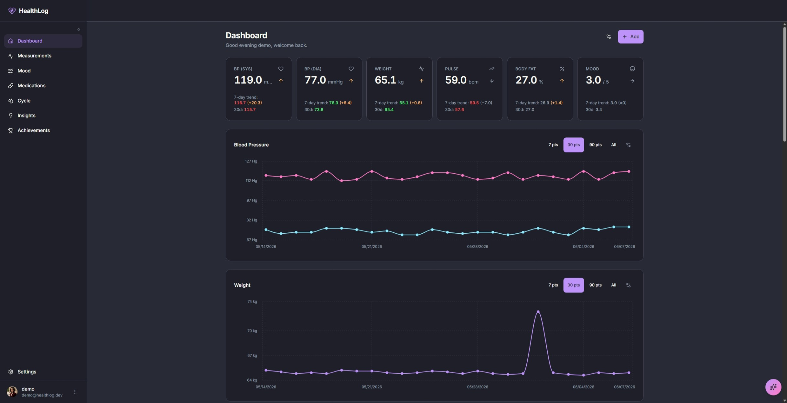

<p align="center">
  
</p>

<h1 align="center">HealthLog</h1>

<p align="center">
  <strong>Self-hosted, privacy-first health tracking. Your vitals, your devices, your server.</strong>
</p>

<p align="center">
  <a href="LICENSE"></a>
  <a href="https://github.com/MBombeck/HealthLog/releases"></a>
  <a href="https://github.com/MBombeck/HealthLog/actions/workflows/integration.yml"></a>
  <a href="https://testflight.apple.com/join/bucuTBpa"></a>
</p>

<p align="center">
  <a href="https://healthlog.dev">Website</a> &middot;
  <a href="https://demo.healthlog.dev">Live Demo</a> &middot;
  <a href="https://docs.healthlog.dev">Documentation</a> &middot;
  <a href="https://testflight.apple.com/join/bucuTBpa">iOS TestFlight</a>
</p>



## Why HealthLog

HealthLog is a self-hosted health tracking app (PWA + native iOS client) that runs from a single `docker compose up` on a NAS, homelab, or small VPS. It brings weight, blood pressure, pulse, blood glucose, body composition, sleep, mood, menstrual cycle, and medications onto one timeline — synced from the devices you already own — and keeps everything encrypted at rest on hardware you control. No vendor cloud, no subscription, no telemetry.

Try the [live demo](https://demo.healthlog.dev) to see a working install.

## Highlights

- **Every vital on one timeline.** Weight, blood pressure, pulse, glucose, body composition, sleep, SpO₂, mood, and cycle tracking — charted with trends, moving averages, and clinical reference ranges (ESH 2023, ADA 2024), overridable with the targets your clinician set.
- **Your devices, one server.** Withings and WHOOP sync over OAuth2, Google Health/Fitbit connects experimentally, an Apple Health `export.zip` folds your full history in, and the native iOS app streams HealthKit live. A per-metric source priority decides which reading is canonical when wearables overlap.
- **Medication tracking that tells the truth.** Flexible schedules (weekly injections, weekday-only, intervals, PRN, cyclic), a configurable intake window per dose, and a traceable dose history where every slot reads taken, late, skipped, or missed — the same ledger the compliance rate is computed from, so the percentage can never disagree with the timeline.
- **AI insights you own.** Daily briefing, health scores, correlations, and a conversational coach grounded in your own measurements, with proactive check-ins. Bring your own OpenAI or Anthropic key, or point at a local endpoint (Ollama, LM Studio, vLLM) so nothing leaves your network.
- **Clinician-ready output.** A doctor-report PDF generated client-side, a read-only HL7 FHIR R4 API, and scoped, time-limited share links you revoke after the visit.
- **Private by construction.** AES-256-GCM encryption at rest with zero-downtime key rotation, passkey login, server-side sessions, strict CSP — and no third-party tracking anywhere.
- **Built to be lived in.** Installable PWA with offline support, medication reminders over APNs, Telegram, ntfy, and Web Push, a sub-second dashboard on years of imported history, English and German end to end.

The full feature tour, integration guides, and API reference live at [docs.healthlog.dev](https://docs.healthlog.dev).

## Quick start

```bash
git clone https://github.com/MBombeck/HealthLog.git && cd HealthLog
cp .env.example .env
echo "POSTGRES_PASSWORD=$(openssl rand -hex 32)" >> .env
echo "ENCRYPTION_KEY=$(openssl rand -hex 32)" >> .env
echo "API_TOKEN_HMAC_KEY=$(openssl rand -hex 32)" >> .env
docker compose up -d
```

Open **http://localhost:3000** — the first registered user becomes admin. The compose file pulls a pre-built multi-arch image (`amd64` + `arm64`) from [GHCR](https://github.com/MBombeck/HealthLog/pkgs/container/healthlog); no build step required. Behind a reverse proxy, set `NEXT_PUBLIC_APP_URL` and `APP_URL` first — see the [self-hosting guide](https://docs.healthlog.dev/self-hosting/).

## Self-hosting

One container hosts both the web server and the job worker by default; split them via `HEALTHLOG_PROCESS_TYPE=web|worker` for horizontal scale. Encrypted daily backups to any S3-compatible bucket are opt-in via the admin panel, new users join by invite link or QR code, and the stack works out of the box behind Caddy, Traefik, Nginx, or [Coolify](https://coolify.io/).

HealthLog ships releases roughly weekly. Pin a tag, back up before upgrades, and skim the [CHANGELOG](CHANGELOG.md) before pulling `latest`. The operator manual — reverse proxy, migrations, encryption-key rotation, backup and restore — lives at [docs.healthlog.dev](https://docs.healthlog.dev).

## Native iOS app

A SwiftUI companion in public beta via [TestFlight](https://testflight.apple.com/join/bucuTBpa), built on the same API as the web client: live HealthKit two-way sync, medication reminders with action buttons that work without opening the app, and an on-device coach on Apple-Intelligence-capable iPhones. Code lives in [MBombeck/healthlog-iOS](https://github.com/MBombeck/healthlog-iOS).

## Tech stack

Next.js 16 (App Router, React Server Components), TypeScript strict, PostgreSQL 16 with Prisma, pg-boss for jobs, Tailwind CSS 4 + shadcn/ui, Recharts, WebAuthn passkeys, Vitest + Playwright, multi-stage Alpine Docker image. The OpenAPI 3.1 contract for native clients is generated from the Zod schemas at [`docs/api/openapi.yaml`](docs/api/openapi.yaml).

## Documentation

|                        |                                                  |
| ---------------------- | ------------------------------------------------ |
| User and operator docs | [docs.healthlog.dev](https://docs.healthlog.dev) |
| Release history        | [CHANGELOG.md](CHANGELOG.md)                     |
| API contract           | [`docs/api/openapi.yaml`](docs/api/openapi.yaml) |
| Security policy        | [SECURITY.md](SECURITY.md)                       |
| Contributing           | [CONTRIBUTING.md](CONTRIBUTING.md)               |

## Status

Actively developed — new releases roughly weekly, issue reports and PRs welcome. Behaviour and schema can change between versions; migrations are forward-only.

## License

HealthLog is licensed under the [PolyForm Noncommercial License 1.0.0](LICENSE): free to use, self-host, and modify for noncommercial purposes. Commercial use requires a separate agreement — open an issue or reach out via [healthlog.dev](https://healthlog.dev). Releases up to and including v1.15.18 were published under AGPL-3.0 and remain available under that license.

---

<p align="center">
  <a href="https://healthlog.dev">healthlog.dev</a> &middot;
  <a href="https://demo.healthlog.dev">Live Demo</a> &middot;
  <a href="https://docs.healthlog.dev">Docs</a> &middot;
  <a href="https://testflight.apple.com/join/bucuTBpa">iOS TestFlight</a> &middot;
  <a href="https://buymeacoffee.com/mbombeck">Buy Me a Coffee</a>
</p>
